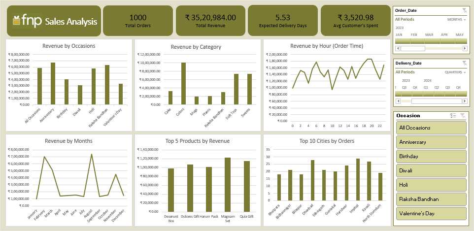

# 🌸 Ferns and Petals (FNP) Sales Analysis Report

## 📌 Project Overview

Ferns and Petals (FNP) is a leading gifting brand in India. The dataset contains order details such as **products, customers, order dates, delivery dates, categories, occasions, and cities**.  
The goal was to build an **interactive dashboard** that uncovers key insights into **sales performance, product demand, and customer spending behavior**.

---

## 🎯 Business Questions

The project addresses the following:

1. What is the **total revenue generated**?
2. What is the **average order delivery time**?
3. How do **sales fluctuate monthly** across 2023?
4. Which are the **top 5 products by revenue**?
5. What is the **average customer spending per order**?
6. Which are the **top 10 cities by orders**?
7. What is the **revenue distribution across occasions**?
8. What is the **revenue distribution across product categories**?
9. How does **order time affect revenue**?
10. Are there **delivery delays linked with higher order volumes**?

---

## 📊 Key Metrics

- **Total Orders**: 1,000
- **Total Revenue**: ₹35,20,984.00
- **Expected Delivery Days**: 5.53
- **Average Customer Spend**: ₹3,520.98

---

## 🔍 Insights

- **Occasion Revenue**: Anniversary & Raksha Bandhan are top contributors.
- **Product Categories**: Soft Toys & Sweets dominate revenue.
- **Sales by Time**: Peaks observed across various hours of the day.
- **Monthly Trends**: Highest revenue months visible in the Revenue by Months chart.
- **Top 5 Products by Revenue**: Deserunt Box, Dolores Gift, Harum Pack, Magnam Set, Quia Gift Set.
- **Top Cities by Orders**: Bhilwara, Bikaner, Bilaspur, Dhanbad, Dibrugarh, Guntakal, Haridwar, Imphal, Kavali, North Dumdum.
- **Customer Behavior**: Average spend of ₹3,520.98 per order across 1,000 total orders.

---

## ✅ Recommendations

1. Focus marketing on **festivals & anniversaries**.
2. Target **top cities** (Bhilwara, Bikaner, Haridwar, etc.).
3. Strengthen **Soft Toys & Sweets** categories.
4. Run **campaigns during peak hours**.
5. Reduce **average delivery time** (currently 5.53 days).
6. Launch **loyalty programs** for repeat customers.

---

## 🛠️ Tools & Technologies

- **Excel** – Data Export & Preparation, Dashboard Creation & Insights

---

**Dataset** - https://drive.google.com/drive/folders/1g288CMDAVIEyzdvtBIN20s49skOpLoub?usp=drive_link

---

---

Created By - [ OMKAR JAGTAP ]  
CONTACT - jagtapomkar39@gmail.com
